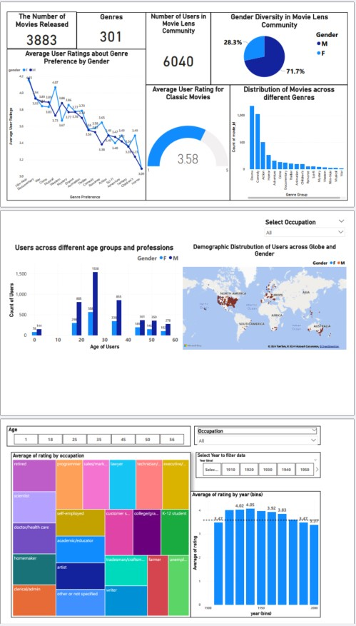

# MovieLens Classic Movies Analysis Power-BI Report

## Project Overview

This project involves analyzing data from the MovieLens platform to create insights for the "Movie Talkies: Classic" edition. The goal is to explore classic movies (released until the year 2000) and provide a detailed analysis of user preferences, demographics, and movie ratings. The analysis is presented through an interactive Power-BI Report.

## Preview
### Power-BI Movie-Analysis-Report SnapShot

## Business Context

MovieLens is an online platform that provides a comprehensive database of movies, TV series, and streaming content. The company aims to connect with viewers who have strong movie preferences and promote classic movies to attract new customers. This project focuses on understanding the characteristics of classic movies, user interests, and the relationship between user demographics and movie ratings.

## Problem Statement

The challenge is to analyze and present a wealth of information about classic movies in a visually engaging manner. The analysis addresses the following key questions:

1. **Movies and Genres**:
   - How many movies were released until 2000?
   - How many distinct genres have emerged up to 2020?

2. **User Demographics**:
   - How many users are part of the MovieLens community?
   - What is the gender diversity in the community?

3. **Genre Preferences**:
   - What are the genre preferences of different genders?
   - How do users engage with various genres?

4. **Ratings and Reception**:
   - What is the average user rating for classic movies?
   - How does the distribution of movies vary across genres?

5. **Demographic Insights**:
   - What is the demographic distribution of users across gender and location?
   - How do users across different age groups and professions engage with classic movies?

6. **Top-Rated Movies and Genres**:
   - Which classic movies and genres are top-rated?
   - How do ratings differ based on user age and occupation?

7. **Age and Ratings**:
   - Is there a link between user age and the ratings they provide for classic movies?
   - How do average ratings vary over the years based on genre?

## Key Insights

- **Community Overview**:
  - The MovieLens community consists of 6,040 users, with a gender distribution of 71.7% male and 28.3% female.
  - A total of 3,883 movies were released until 2000, spanning 28 distinct genres.

- **Genre Preferences**:
  - Male users show a preference for genres like Action, Sci-Fi, and Thriller, while female users lean towards Romance and Drama.
  - The average user rating for classic movies is approximately 3.8, with variations across genres.

- **Demographics**:
  - Users are distributed across various age groups, with significant engagement from users aged 18-35.
  - The platform attracts users from diverse professions, including students, educators, and professionals.

- **Top-Rated Movies and Genres**:
  - Genres like Film-Noir and Animation receive higher average ratings compared to others.
  - Ratings vary significantly based on user age and occupation, revealing generational and professional preferences.

## Power BI Report

The analysis is presented through an interactive Power BI Report, which includes:

- Visualizations for each of the key questions.
- Slicers and navigation items for dynamic filtering and exploration.
- Insights into user demographics, genre preferences, and rating trends.

## How to Use

1. Download the `.pbix` file from the repository.
2. Open the file in Power BI Desktop.
3. Explore the Report using the slicers and filters to gain insights into the data.

## Files in the Repository

- **`MovieLens_Classic_Analysis.pbix`**: The Power BI report file containing the analysis and visualizations.
- **`README.md`**: This file, providing an overview of the project.

## Tools and Technologies

- **Power BI**: For data visualization and Report creation.

## Conclusion

This project provides a comprehensive analysis of classic movies and user preferences on the MovieLens platform. The insights can help MovieLens engage with its audience more effectively and promote classic movies to a broader audience.
